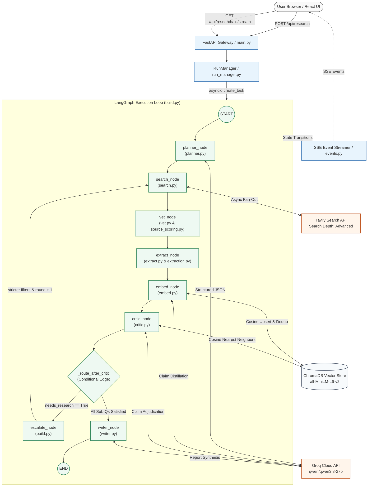

# Brief — System Architecture & Technical Deep-Dive

This document provides a comprehensive, interview-ready breakdown of **Brief** (an autonomous research-to-report agent). It details the architectural rationale, state machine transitions, algorithmic scoring heuristics, vector store mechanics, failure boundaries, and operational tradeoffs of the entire system.

---

## 1. High-Level System Overview

When a user submits a complex research inquiry through the frontend, the FastAPI gateway initializes an asynchronous background task managed by `RunManager` and returns an active run identifier. An LLM planner first decomposes the topic into 3–6 focused, mutually distinct, search-optimized sub-questions. These sub-questions are dispatched concurrently via an async fan-out to the Tavily Web Search API to gather candidate web documents.

A deterministic vetting engine scores and ranks each candidate against domain trust tiers, primary-source indicators, and publication recency, discarding aggregators and selecting only the top-tier sources for full-text HTTP extraction. Extracted articles are parsed, bounded to 12,000 characters, and distilled by an LLM into atomic factual assertions.

These atomic claims are embedded into a local persistent Chroma vector database using `all-MiniLM-L6-v2` in cosine space, where intra-source duplicates are discarded. An adversarial LLM critic performs semantic nearest-neighbor searches across opposing domains, prompting an LLM adjudicator to classify each assertion as **Verified** (confirmed by 2+ independent domains), **Unverified** (single-source assertion), or **Disputed** (direct contradiction detected). If verified evidence is insufficient, the system dynamically loops back for a stricter research pass. Once evidence stabilizes, a writer node compiles a cited, narrative digital essay with deterministic citation bindings.

---

## 2. End-to-End Architecture Diagram

The execution engine is orchestrated as a stateful, cyclical directed graph using **LangGraph** (`StateGraph`).



---

## 3. Step-by-Step Data Flow & State Machine

### The Shared LangGraph State Schema
State persistence across graph nodes is managed via `GraphState` defined in `backend/app/graph/state.py`. `total=False` allows graph nodes to return partial dictionary updates that are merged by overwrite:

```python
class GraphState(TypedDict, total=False):
    topic: str                     # Initial user prompt
    sub_questions: list[SubQuestion] # Full collection of sub-questions, candidates & claims
    active_ids: list[str]          # IDs processed in current execution round (e.g. ['sq1', 'sq2'])
    research_round: int            # 0 for initial pass; >0 for stricter re-searches
    report: Optional[Report]       # Final structured report object
    errors: list[str]              # Non-fatal execution errors
```

---

### Step 1: Planner (`planner_node`)
* **Source Location**: `backend/app/graph/nodes/planner.py`
* **Input Received**: `state["topic"]`.
* **Output Produced**: `{"sub_questions": list[SubQuestion], "research_round": 0}`.

#### Internal Mechanics & Decisions
1. **Structured LLM Invocation**: The node invokes `llm.structured(PlannerOutput, ...)` via Groq using the `qwen/qwen3.8-27b` model.
2. **Floor Enforcement**: If the model returns fewer than `settings.min_sub_questions` (default: 3), a deterministic fallback loop appends synthetic facet questions to guarantee research breadth.
3. **Temporal Awareness**: The prompt forces the LLM to tag each sub-question with `time_sensitive: bool`. This informs whether downstream search queries restrict results to recent publications.

#### Architectural Tradeoff: Why Pre-Plan Instead of a Free-Form ReAct Loop?
* **Alternative**: A standard ReAct (Reason + Act) agent deciding next steps dynamically on every turn.
* **Why Brief chose Pre-Planning**: ReAct agents suffer from **query drift**—they get sidetracked by secondary details found in early search results and fail to cover the original topic comprehensively. Decomposing the problem up-front establishes clear coverage boundaries and enables **parallel execution** (searching 4 sub-questions concurrently rather than sequentially).

---

### Step 2: Search (`search_node`)
* **Source Location**: `backend/app/graph/nodes/search.py`
* **Input Received**: `state["sub_questions"]` and `state["research_round"]`.
* **Output Produced**: `{"sub_questions": updated_sub_questions, "active_ids": active_ids}`.

#### Internal Mechanics & Decisions
1. **Target Identification**: In round 0, all sub-questions are active. In round >0, only sub-questions flagged with `needs_research == True` are processed.
2. **Async Fan-Out**: Uses `asyncio.gather` to query the Tavily API concurrently across all active sub-questions.
3. **Temporal Filter**: If `sq.time_sensitive` is `True`, the Tavily call passes `days=365` to restrict results to the past year.
4. **Candidate Ingestion**: For each result, parses the raw URL with `urllib.parse` to extract `domain`, assigns a preliminary domain tier, and inspects snippet tokens for primary source indicators.

#### Architectural Tradeoff: Why Tavily Over Raw Google Scraping / SerpAPI?
* **Alternative**: Custom Playwright scrapers or SerpAPI.
* **Why Brief chose Tavily**: Raw Google scraping faces frequent CAPTCHAs, bot bans, and inconsistent DOM markup. Tavily provides an API optimized for LLM agents: it filters out search bloat, returns pre-cleaned markdown snippets, and includes relevance ranking scores out of the box.

---

### Step 3: Vet (`vet_node`)
* **Source Location**: `backend/app/graph/nodes/vet.py` & `backend/app/services/source_scoring.py`
* **Input Received**: Candidates associated with active sub-questions.
* **Output Produced**: Updated candidates with `vet_score` calculated and `selected: bool` assigned.

#### Algorithmic Scoring Heuristic
Every source candidate is assigned a score:
`vet_score = BaseTier + PrimarySourceHintBonus + RecencyBonus + 0.1 * TavilyScore`

1. **Base Tier**:
   * **Tier 1 (Primary — 1.0)**: `.gov`, `.edu`, `.mil`, PubMed, arXiv, Nature, Science, NEJM, Lancet, SEC EDGAR, World Bank, OECD.
   * **Tier 2 (Major Outlets — 0.75)**: Reuters, AP News, BBC, NYT, WSJ, Bloomberg, FT, The Economist, ProPublica.
   * **Tier 3 (General Reputable — 0.50)**: Standard industry websites and commercial publications.
   * **Tier 4 (Low Authority — 0.20)**: Self-published platforms (Medium, Substack, Blogspot, WordPress, BuzzFeed).
2. **Primary Source Hint Bonus (+0.15)**: Added if the URL or snippet matches tokens like `doi.org`, `arxiv`, `clinicaltrials`, `peer-reviewed`, `10-k`, or `dataset`.
3. **Recency Bonus (+0.1 to +0.2)**: If `time_sensitive` is active:
   * Age <= 1 year -> +0.2
   * Age <= 3 years -> +0.1
4. **Aggregator Capping**: Aggregators like Wikipedia, Britannica, Quora, and Reddit are classified as `lead_only`. Their score is hard-capped to `min(S, 0.05)` and they are excluded from the citable pool.
5. **Selection Threshold**: Top K=3 non-aggregator candidates are flagged `selected = True`.

---

### Step 4: Extract (`extract_node`)
* **Source Location**: `backend/app/graph/nodes/extract.py` & `backend/app/services/extraction.py`
* **Input Received**: Candidates flagged with `selected == True`.
* **Output Produced**: Candidates updated with `extracted: bool` and `extracted_text`.

#### Content Extraction Pipeline
1. **Primary**: `trafilatura.extract(html)` extracts core article bodies while stripping boilerplates, navigation banners, and cookie prompts.
2. **Fallback**: If Trafilatura fails, BeautifulSoup strips `<script>`, `<style>`, `<nav>`, `<header>`, `<footer>`, and `<noscript>` tags before extracting raw paragraph text.
3. **Payload Truncation**: Extracted bodies are clamped to 12,000 characters to prevent context window exhaustion during claim distillation.

---

### Step 5: Embed & Store (`embed_node`)
* **Source Location**: `backend/app/graph/nodes/embed.py`, `vectorstore.py`, `embeddings.py`
* **Input Received**: Extracted article text for active sub-questions.
* **Output Produced**: Atomic `Claim` objects stored in state and indexed in ChromaDB.

#### Internal Mechanics & Decisions
1. **LLM Distillation**: Extracted texts are sent to the LLM to extract atomic, self-contained factual claims.
2. **Local Embedding Generation**: Each claim is encoded into a 384-dimensional vector using `all-MiniLM-L6-v2`.
3. **Intra-Source Deduplication**: If an existing claim from the same domain and sub-question has cosine similarity >= 0.94, the redundant claim is dropped.
4. **Metadata Indexing**: Unique claims are upserted with metadata (`run_id`, `sub_question_id`, `domain`, `url`).

---

### Step 6: Critic (`critic_node`)
* **Source Location**: `backend/app/graph/nodes/critic.py`
* **Input Received**: Claims generated across active sub-questions.
* **Output Produced**: Verified, Unverified, or Disputed status assigned to every claim; `needs_research` set if verified claims are scarce.

#### Corroboration Logic & The Cross-Domain Matcher
For every claim, queries Chroma for similar claims from **other** domains (`domain != claim.source_domain`) with cosine similarity >= 0.80.
Because high vector similarity alone indicates topical overlap rather than agreement, the pair is sent to an LLM adjudicator:
* If >= 1 independent domain contradicts: `status = ClaimStatus.DISPUTED`
* Else if >= 1 independent domain agrees: `status = ClaimStatus.VERIFIED`
* Otherwise: `status = ClaimStatus.UNVERIFIED`

If verified claims < 1 and retries remain, triggers `needs_research = True` for an escalated research pass.

---

### Step 7: Writer (`writer_node`)
* **Source Location**: `backend/app/graph/nodes/writer.py`
* **Input Received**: Full collection of vetted sub-questions, claims, and verified citations.
* **Output Produced**: `{"report": Report}`.

#### Deterministic Citation Pipeline
1. `_assign_citations` assigns 1-based sequential integers to all sources backing claims.
2. Briefing prompt provides numbered claims with status annotations ([n], [n]†, [n]‡).
3. The LLM synthesizes an essay following these citation keys.
4. Code appends the deterministic `## Sources` list and veracity stats.

---

## 4. Vector Database Deep-Dive

* **Engine**: ChromaDB (`chromadb.PersistentClient`) storing collections at `backend/data/chroma`.
* **Embedding Model**: `all-MiniLM-L6-v2` via SentenceTransformers (384-dimensional dense vectors).
* **Distance Metric**: Cosine Space (`hnsw:space: "cosine"`).
* **Formula**: `Cosine Similarity = 1.0 - Cosine Distance`.
* **Deduplication Threshold**: 0.94 within the same domain.
* **Corroboration Threshold**: 0.80 across independent domains.

---

## 5. Failure Modes & Resilience Architecture

* **Tavily returns 0 results**: Treated gracefully; unverified question flagged for stricter retry; if exhausted, noted cautiously in briefing without crashing.
* **HTTP extraction blocked (403, Cloudflare, Paywall)**: Caught in `try/except` returning `(None, False)`; unextracted sources skipped.
* **Groq API Rate-Limit (429)**: Handled via Tenacity exponential backoff (`@retry(stop=stop_after_attempt(3), wait=wait_exponential(multiplier=1, min=1, max=8))`).
* **Fatal Outages**: RunManager flags status as `error`, emits SSE error event, and closes connections cleanly.
* **Conflicting findings**: Classified as `DISPUTED` and rendered with double dagger glyph (`‡`).

---

## 6. Known Limitations & Production Roadmap

1. **In-Memory Run Registry**: Currently in Python process dictionary; upgrade to PostgreSQL/Redis with persistent checkpointer.
2. **CPU Embeddings**: Local CPU inference; upgrade to dedicated microservice (TEI / Triton) at high scale.
3. **Static Scraping**: Uses HTTPX/Trafilatura; upgrade with headless browser pool (Playwright) for JS-rendered SPAs.
4. **Cross-Sub-Question Corroboration**: Currently isolated by sub-question ID; upgrade to global cross-question clustering.
5. **Conversational Memory**: Currently one-shot execution; upgrade to multi-turn conversational branching.

---

## 7. Technical Glossary

* **LangGraph**: Framework for building stateful multi-actor agent loops with cycles, conditional branching, and human-in-the-loop controls.
* **StateGraph**: Core LangGraph class parameterized by `GraphState`, defining state transitions between functional nodes.
* **HNSW (Hierarchical Navigable Small World)**: Multi-layer graph index for logarithmic time Approximate Nearest Neighbor vector search.
* **Cosine Similarity**: Directional cosine angle between vectors, invariant to document length.
* **Server-Sent Events (SSE)**: Unidirectional real-time HTTP streaming protocol (`text/event-stream`) with automatic browser reconnection.
* **Structured Output Decoding**: Constraining model generation to valid JSON adhering to a Pydantic schema.
